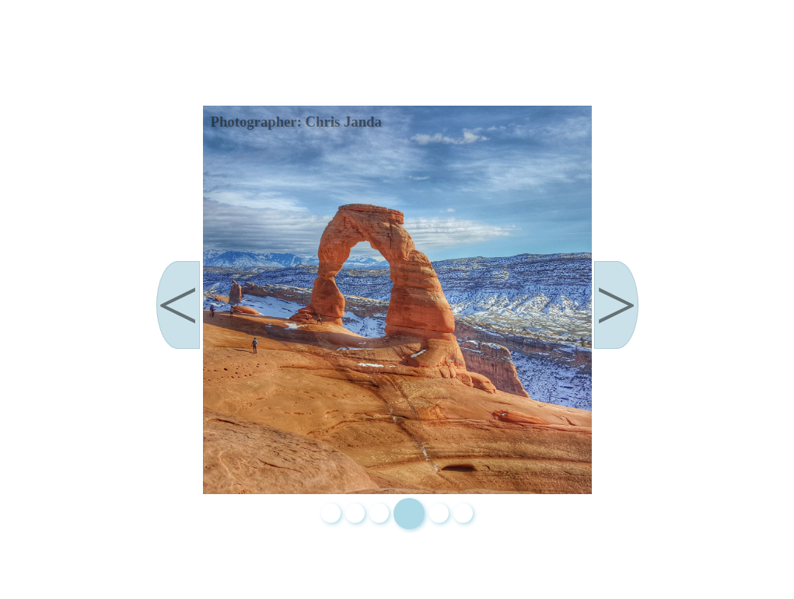

# Image-Slider

Image Slider made for The Odin Project
<a href="https://github.com/sirjamo1.io/To-Do-List-Odin">Link to live preview</a>

Image Slider was built for The Odin Project.

-   Image changes every 5 seconds.
-   Photographers name changes with image.
-   Image alt changes with image.
-   Dots change with image.
-   Click image to pause/resume 5 second changes.
-   Click left/right/dot buttons to change image (also resumes 5 second changes).
-   Animation pause/play pops up on click.
-

Images from www.pexels.com

Photographers include :

-   Aleksey Kuprikov
-   Amit Kumar
-   Chris Janda
-   Martin Alargent
-   Matthis Volquardsen
-   Samet Kasik
